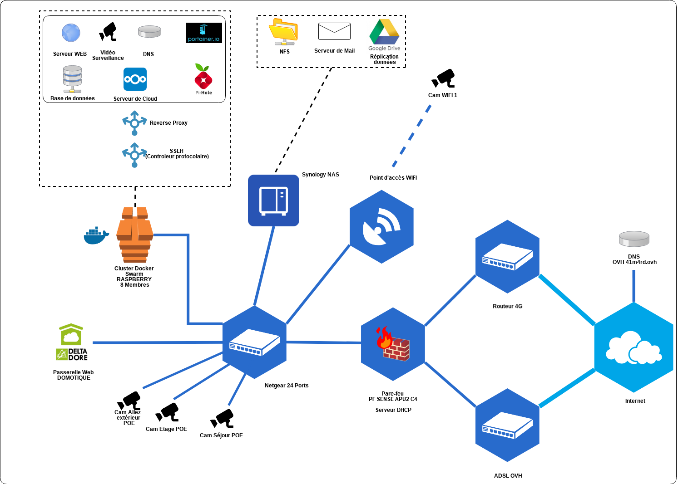

## Index :

## Qui suis-je ?

Je m'appelle Benjamin, je suis Consultant en Cybersécurité. Mon travail consiste à avoir une expertise technique dans le domaine de la cybersécurité. J'aide mes clients à concevoir ou orienter leur système d'information de manière sécurisé. Il existe différents domaines qui peuvent entrer en jeu, comme la sécurité des réseaux, des logiciel ou encore des utilisateurs. Je peux intervenir sur chacun de ces domaines pour réaliser un audit, proposer une architecture ou tout simplement réaliser l'infrastructure. C'est à dire que je peux être sur un niveau conceptuel, décisionnel ou bien technique. J'attache beaucoup d'importance à pouvoir évoluer dans tous ces niveaux d'un système d'information car il me permet d'être un facilitateur dans les entreprises. Chaque niveau pourront ainsi se comprendre et s'aider pour que l'objectif d'une entreprise soit atteinte.

Je suis avant tout un passionné de cybersécurité qui cultive la polyvalence. Je suis compétiteur dans l'âme ce qui implique que j'aime les challenges. Mon défaut principal est que parfois j'avance en force, ma qualité essentielle reste ma positivité à toute épreuve. Je suis également capable de monter en compétence rapidement sur divers sujets.

Mon profil n'est pas un profil spécialisé !

<b>La bonne humeur et la bienveillance se communiquent quotidiennement.</b>
<!-- ----------------------------------------------------------------------------------------------------------------- -->

## Expérience

<!-- ----------------------------------------------------------------------------------------------------------------- -->

<table style="border: 1px solid white;">
<tr><td colspan="3"><h2>Connaissances par domaine</h2></td></tr>
<tr>
<td><h3>Informatique et sécurité</h3>

Gestion des risques

<ul>
    <li>Analyse des risques sur un projet de migration de logiciel</li>
    <li> Veille sur les risques des SI et suivi des failles de sécurité</li>
    <li>ISO 27005 en cours de préparation ...</li>
</ul>

Environnements

<ul>
    <li>Windows, Windows Serveur</li>
    <li>Mac OS, Debian, Ubuntu</li>
</ul>

Authentification

<ul>
    <li>Gemalto BLACKSHIELD (Authentification)</li>
    <li>Freeradius</li>
    <li>LDAP</li>
    <li>OTP/TOP</li>
    <li>U2F</li>
    <li>Certificat/Yubikey etc.</li>
</ul>

Scripting

<ul>
    <li>VBS</li>
    <li>BASH</li>
    <li>PYTHON</li>
</ul>   

Gestion de parc, Configuration

<ul>
    <li>GLPI</li>
    <li>Ansible</li>
</ul>   

</td><td>
<h3>Méthode de conceptualisation</h3>

Méthodologies

<ul>
    <li>Cycle en V</li>
    <li>Méthode agiles</li>
    <li>merise (Méthode systémique)</li>
    <li>UML</li>
</ul>

Programmation

<ul>
    <li>Programmation Orientée Objet</li>
    <li>Cobol</li>
    <li>Prolog (programmation inférentielle)</li>
    <li>Web (PHP, JS, HTML, Sql, CSS)</li>
    <li>Application (Java, JEE, Android, C++, VB.Net)</li>
    <li>WebService, RESTFULL</li>
</ul>

Framework

<ul>
    <li>Symfony</li>
    <li>Nextcloud (app)</li>
</ul>

</td></tr><tr><td>
<h3>Base de données</h3>

Administration

<ul>
    <li>Oracle</li>
    <li>Mysql/MariaDB</li>
</ul>

Big Data

<ul>
    <li>EAI/ETL IBM Cognos, Talend</li>
    <li>Architecture type DATAWARE HOUSE</li>
    <li>Business Object, Installation, Création de Rapport</li>
    <li>Ensemble Elastik (ELK)</li>
</ul>

</td><td>
<h3>Réseau</h3>

Pare-feu

<ul>
    <li>Stormshield</li>
    <li>PfSense</li>
    <li>Checkpoint</li>
    <li>McAfee - Forcepoint</li>
</ul>

VPN

<ul>
    <li>IPSEC Général</li>
    <li>IPSEC Site à Site</li>
    <li>IPSEC Mobile</li>
    <li>OpenVPN</li>
</ul>

</td></tr></table>

#### [Index](./#index)
<!-- ----------------------------------------------------------------------------------------------------------------- -->

## Formation

<strong>2013 - 2015</strong> Master MIAGE

    Méthodes Informatiques Appliquées à la Gestion des Entreprises  
    Université Bordeaux 1  
    Éffectué en apprentissage

<strong>2012 - 2013</strong> Licence MIAGE

    Méthodes Informatiques Appliquées à la Gestion des Entreprises  
    Université Paul Sabatier (Toulouse III)  
    Éffectué en apprentissage

<strong>2010 - 2012</strong> BTS IG

    BTS Informatique de Gestion - Option développeur  
    Lycée Gustave Eiffel  
    Éffectué en apprentissage

<strong>2008 - 2010</strong> Licence DROIT, (1er année) ADMIS

    Université Montesquieu-Bordeaux IV  
    Travail étudiant en parallèle

<strong>2006 - 2008</strong> Capacité en droit, DROIT, ADMIS

    Université Montesquieu-Bordeaux IV  
    Travail étudiant en parallèle, ce diplôme est de classe IV (équivalent au baccalauréat).

#### [Index](./#index)

## Certifications/Formations

*   **2019** PfSense Fundamentals and Advanced Application
*   **2019** Docker Certified Associate (Sans formation)
*   **2018** Forcepoint Next Generation Firewall Administrator
*   **2018** Formation Ansible (3 jours)
*   **2018** Formation Forensic et analyse de malware (5 jours)
*   **2017** Stormshield CSNE
*   **2017** Stormshield CSNA

#### [Index](./#index)

## Projets personnels

*   Création d'une stack docker à domicile avec des raspberrys
*   Cluster de Pfsense à domicile
*   Redondance de connexion ADSL / 4G
*   Délégation du stockage sur un NFS

Mon laboratoire personnel : 

#### [Index](./#index)

## Les langues que je parle ou écrit

*   **Français** langue natal - écriture avec des fautes occasionnelles.

*   **Anglais** apprentissage scolaire - utilisé lors de formation suivies, pour des supports techniques (mail et téléphone).

*   **Roumain** - compréhension orale, non écrit. Apprentissage rapide possible.

*   **Assembleur** - En cours d'apprentissage.

#### [Index](./#index)

## Mes participations à des challenges divers

*   **2019** Cybercamp CRPOC
*   **2019** Participation à un Bug Bounty privé (Yes We Hack)
*   **2019** Participation à la Sthack de Bordeaux CTF et conférence
*   **2018** Équipe de tests des challenges de la FIC
*   **2018** Participation au challenge LADON
*   **2018** Cybercamp CRPOC
*   **2018** Participation à la Sthack de Bordeaux CTF
*   **2017** Participation à la Sthack de Bordeaux CTF
*   **2015** Nuit de l'informatique
*   **2014** Nuit de l'informatique - Vainqueur défi accessibilité numérique

#### [Index](./#index)

## Conférences, jury etc ...

*   **2018** Auditeur à Hack-it-n
*   **2018** Auditeur à Sthack
*   **2017** Auditeur à Sthack

#### [Index](./#index)

## Sports

Pourquoi une section sport dans un CV de consultant en Cybersécurité ? 

Je pense que certains défis requièrent un fort esprit d'équipe et de compétition pour être relevés.

*   Combattant en Boxe Française 2ième série
*   Pilote Moto en Vitesse et Moniteur (BFA)

#### [Index](./#index)
